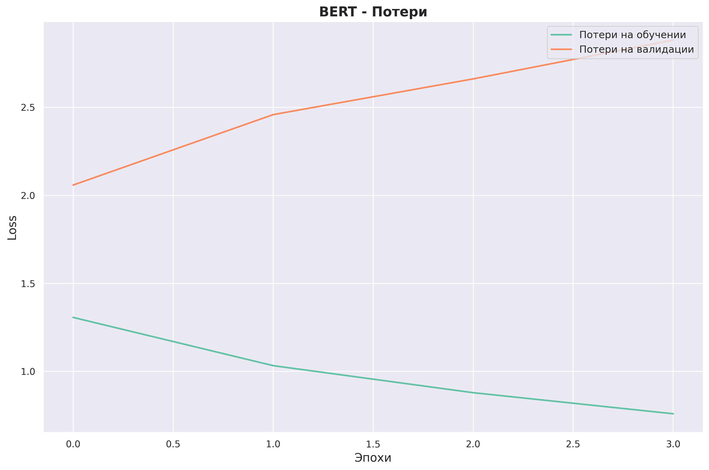
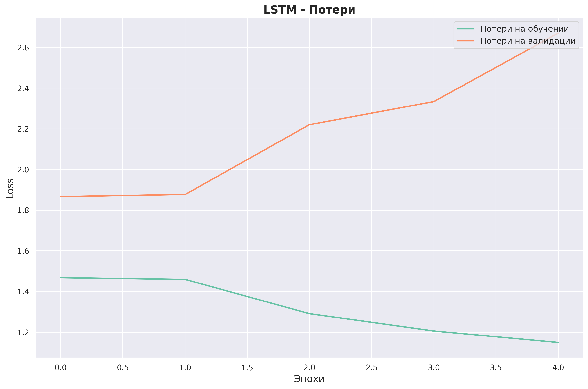
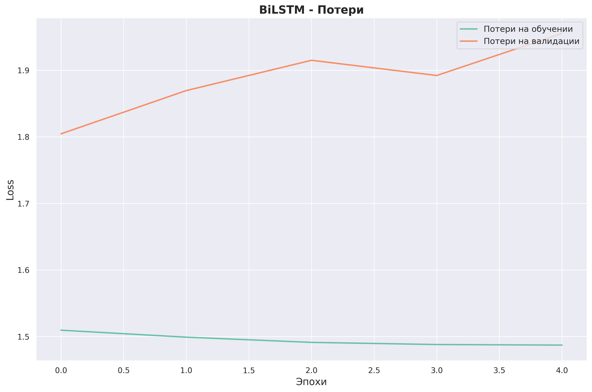
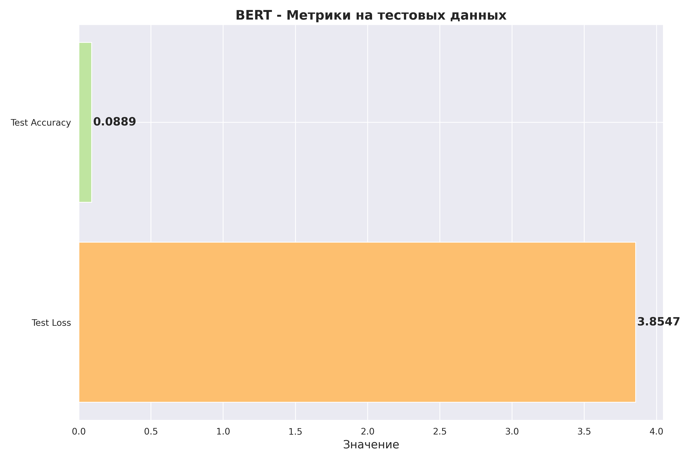
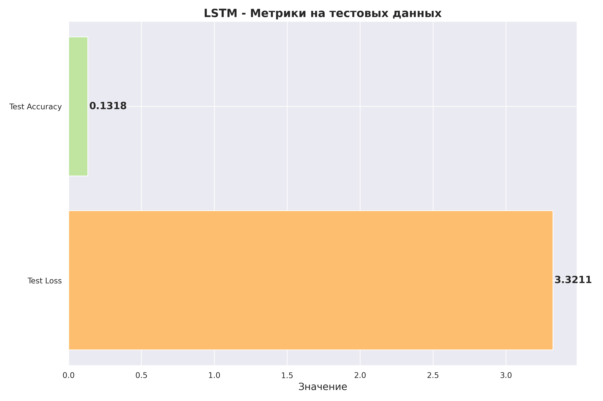
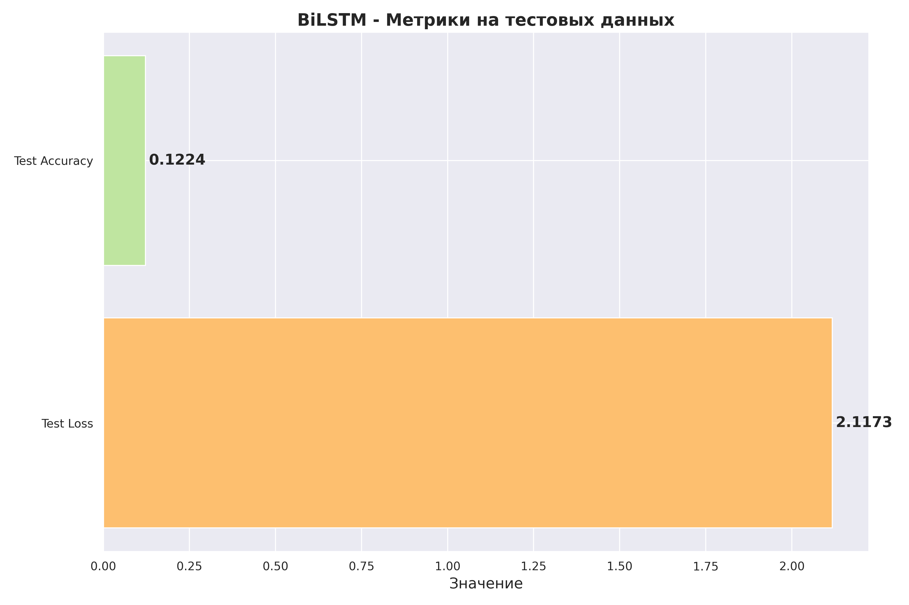

# Прогнозирование авторства текстов с использованием нейронных сетей

Этот проект посвящён разработке и анализу моделей машинного обучения для задачи классификации авторства текстов на основе произведений русских поэтов. В рамках работы были обучены и протестированы три модели нейронных сетей, включая:
- Модель BERT (Bidirectional Encoder Representations from Transformers).
- Модель LSTM (Long Short-Term Memory).
- Модель BiLSTM (Bidirectional Long Short-Term Memory).

## Функционал
- **Предварительная обработка данных**: Очистка текстовых данных, разбиение произведений на фрагменты, создание меток авторства.
- **Разделение данных**: Данные были разделены на обучающую, валидационную и тестовую выборки.
- **Обучение моделей**: Обучение нейронных сетей с использованием предобученной модели BERT, а также LSTM и BiLSTM для оптимальной классификации авторства текстов.
- **Оценка качества моделей**: Использование метрик, таких как Accuracy для оценки точности моделей на тестовых данных.
- **Визуализация процесса обучения**: Построение графиков обучения (потери и точности) для каждой модели.

## Зависимости
Для работы программы необходимы следующие библиотеки:
- `numpy` и `pandas` для обработки данных.
- `scikit-learn` для вычисления метрик и разделения данных.
- `matplotlib` и `seaborn` для визуализации графиков обучения и метрик.
- `torch` и `transformers` для построения и обучения нейронных сетей, включая модели BERT и LSTM.


## Установка и запуск проекта
1. Клонируйте репозиторий:
```
git clone https://github.com/Sogato/NNATA-lab7.git
```
2. Создайте виртуальное окружение:
```
python -m venv env
```
3. Установите зависимости проекта:
```
pip install -r requirements.txt
```
4. Запустите программу:
```
python main.py
```

## Описание наборов данных

Для выполнения задачи классификации текстов по авторству были использованы фрагменты произведений пяти русских поэтов:
- Александр Блок (`blok`)
- Сергей Есенин (`esenin`)
- Владимир Маяковский (`mayakovskij`)
- Александр Пушкин (`pushkin`)
- Фёдор Тютчев (`tyutchev`)

### Размеры выборок:
- **Обучающая выборка**: 13,744 примеров
- **Валидационная выборка**: 1,528 примеров
- **Тестовая выборка**: 3,818 примеров

Каждый текст был разбит на фрагменты длиной не менее 100 символов. В конечном итоге данные были разделены на обучающую, валидационную и тестовую выборки с соотношением 70/15/15.

## Параметры архитектур и обучения нейронных сетей

### Модель 1: BERT
- **Архитектура**: Использована предобученная модель `bert-base-uncased` с добавленным полносвязным слоем для классификации.
- **Параметры обучения**:
  - Количество эпох: 4
  - Начальная скорость обучения: 2e-5
  - Оптимизатор: AdamW
  - Scheduler: Linear Warmup
- **Результаты**:
  - Средняя обучающая потеря: 1.532
  - Валидационная точность: 0.225
  - Тестовая точность: 0.0889

### Модель 2: Стек LSTM
- **Архитектура**: Два последовательных слоя LSTM с добавлением Dropout слоя и полносвязного слоя на выходе.
- **Параметры**:
  - Размер словаря: 30,522
  - Размер вектора эмбеддингов: 100
  - Размер скрытого слоя: 256
  - Количество слоев LSTM: 2
  - Dropout: 0.3
- **Параметры обучения**:
  - Количество эпох: 5
  - Начальная скорость обучения: 1e-3
  - Оптимизатор: Adam
- **Результаты**:
  - Средняя обучающая потеря: 1.487
  - Валидационная точность: 0.296
  - Тестовая точность: 0.131

### Модель 3: Двунаправленная LSTM (BiLSTM)
- **Архитектура**: Один двунаправленный слой LSTM с добавлением Dropout слоя и полносвязного слоя на выходе.
- **Параметры**:
  - Размер словаря: 30,522
  - Размер вектора эмбеддингов: 100
  - Размер скрытого слоя: 256
  - Количество слоев LSTM: 2
  - Dropout: 0.3
- **Параметры обучения**:
  - Количество эпох: 5
  - Начальная скорость обучения: 1e-3
  - Оптимизатор: Adam
- **Результаты**:
  - Средняя обучающая потеря: 1.488
  - Валидационная точность: 0.296
  - Тестовая точность: 0.122

## Графики обучения для архитектур нейронных сетей с лучшими характеристиками эффективности

### График обучения BERT


### График обучения стека LSTM


### График обучения двунаправленной LSTM


### Таблица результатов

| Модель       | Точность на тесте | Потери на тесте |
|--------------|------------------|-----------------|
| BERT         | 0.0889           | 3.8547          |
| Стек LSTM    | 0.1318           | 3.3211          |
| BiLSTM       | 0.1224           | 2.1173          |

### Диаграммы точности моделей





## Заключение

На основе проведенного анализа можно сделать следующие выводы:
- Все три модели показали низкую точность на тестовом наборе данных, что свидетельствует о необходимости дальнейшей настройки моделей или увеличения объема данных.
- Модель стека LSTM показала наилучшую точность (0.1318), но разница между моделями незначительна.
- Модель BERT, несмотря на свою сложность, показала наихудший результат (0.0889).

---

Подготовлено в рамках учебного проекта. Все данные взяты из открытых источников и использованы исключительно в образовательных целях.

---
